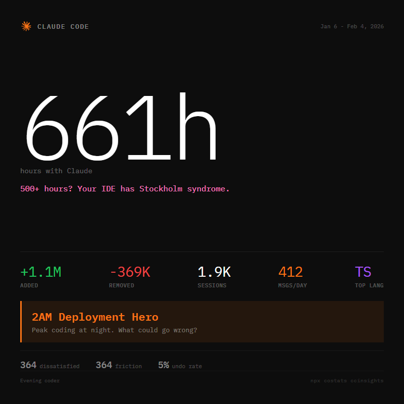

# costats insights-cli 

A CLI tool that generates shareable Claude Code Insights cards from your usage data, with extra personality.

<p align="center">
  
</p>

## What it does
- Reads your Claude Code `/insights` report and extracts structured data.
- Calls Claude API to parse the HTML and enrich insights.
- Generates a stylized PNG card with your stats, a funny programmer title and a personalized roast.
- Auto-assigns titles like "Senior Stack Overflow Dev" or "console.log Specialist" based on your habits.

## Install

**Via npx (no install needed)**
```powershell
npx costats ccinsights
```

**Global install**
```powershell
npm install -g costats
costats ccinsights
```

## Usage

Default run:

```powershell
npx costats ccinsights
```

Best practice for options:

```powershell
npx costats ccinsights --help
```

```powershell
costats ccinsights [options]
```

By default it reads `~/.claude/usage-data/report.html` and writes the PNG to `~/.costats/images/costats-insights.png`.

### Options
| Flag | Description |
|------|-------------|
| `--input <path>` | Path to `report.html` (default: `~/.claude/usage-data/report.html`) |
| `--output <path>` | Output PNG path (default: `~/.costats/images/costats-insights.png`) |
| `--json <path>` | Write extracted JSON to this file |
| `--model <name>` | Claude model override (default: `claude-haiku-4-5`) |
| `--no-open` | Do not open the generated image after creation |
| `-h, --help` | Show help |

## Requirements
- Node.js `>=18`
- Claude Code signed in (uses `~/.claude/.credentials.json`)
- A Claude Code insights report (run `/insights` in Claude Code first)

## How it works
1. Reads your Claude Code insights HTML report.
2. Sends it to Claude API to extract structured data (messages, sessions, hours, lines changed, languages, outcomes, etc.).
3. Generates a funny title and roast based on your usage patterns.
4. Renders a PNG card using Playwright/Chromium.

## Funny titles
Your card gets a personalized title based on your stats:

| Stat | Example Title |
|------|---------------|
| 2000+ hours | "localhost Is My Home" |
| 1000+ hours | "Works On My Machine" |
| 500+ hours | "Senior Stack Overflow Dev" |
| 200+ hours | "console.log Specialist" |
| 1000+ msgs/day | "Rubber Duck Replacement" |
| Low achievement | "Ctrl+Z Speedrunner" |
| Night coder | "2AM Deployment Hero" |
| More deleted than added | "Delete Key Advocate" |

## Notes
- First run may download a Playwright Chromium binary in the background.
- The card includes: hours with Claude, sessions, lines added/removed, messages per day, top language, peak coding time, and "shame stats" (dissatisfied count, friction events, undo rate).
- All data stays local - the only external call is to Claude API for parsing.

## License
MIT
